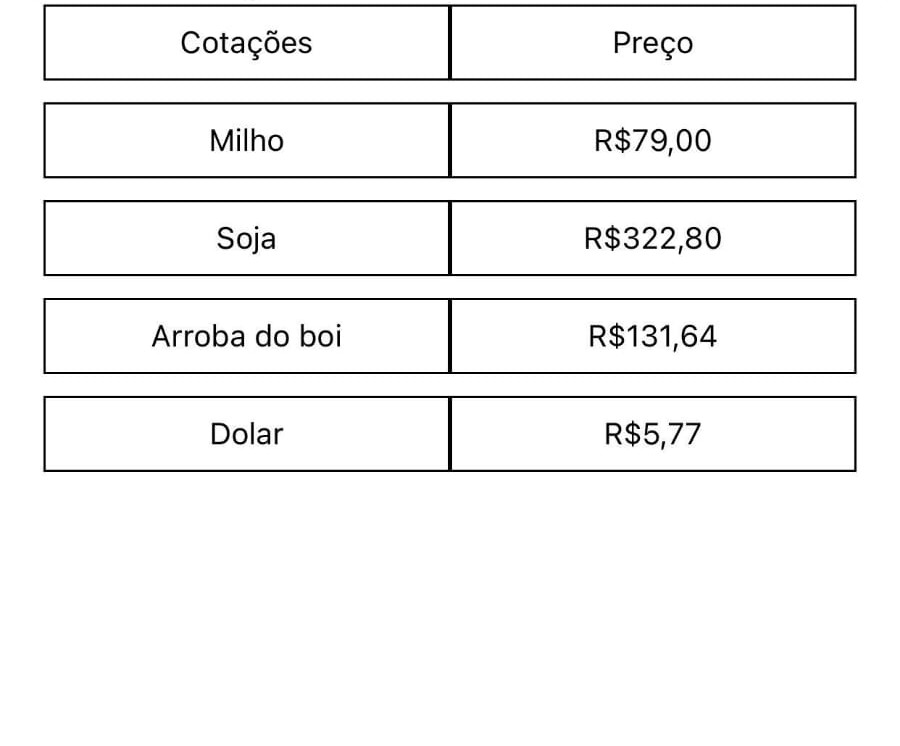

# App que retorna cotações usando React-Native + Google Scripts + Google Sheets

## Descrição 
Google Apps Script é uma plataforma de script desenvolvida pelo Google para desenvolvimento de aplicativos leves na plataforma Google Workspace.
Já o Google Sheets é um programa de planilhas incluído como parte do pacote gratuito de Editores de Documentos Google baseado na Web oferecido pelo Google. 

## Google Sheets 
->Passo 1: Criar uma nova planilha no Google Planilhas 
->Passo 2: Ir em Extensões>Apps Script
->Passo 3: Ir para o projeto do Apps Script que será criado automaticamente

## Apps Scripts
->Passo 1: Criar o código que fará o Scraping das cotações 

## Código do Apps Script usado pra fazer o Scraping:

```js
   function myFunction() {
        const urls = [
            { url: 'https://www.noticiasagricolas.com.br/cotacoes/milho', nome: 'Milho', linha: 2 },
            { url: 'https://www.noticiasagricolas.com.br/cotacoes/boi-gordo', nome: 'Boi Gordo', linha: 3 },
            { url: 'https://www.noticiasagricolas.com.br/cotacoes/soja', nome: 'Soja', linha: 4 },
            { url: 'https://www.noticiasagricolas.com.br/cotacoes/', nome: 'Dólar', linha: 5, tipo: 'dolar' }
        ];

        const sheet = SpreadsheetApp.getActiveSpreadsheet().getActiveSheet();

        urls.forEach(commodity => {
            const response = UrlFetchApp.fetch(commodity.url, { muteHttpExceptions: true });

            if (response.getResponseCode() === 200) {
            let html = response.getContentText();
            let valor = null;

            if (commodity.tipo === 'dolar') {
                // Regex para capturar "R$ 5,76" da div <div class="valor vermelho">
                let regexDolar = /<div class="valor (?:verde|vermelho)">R\$ ([\d.,]+)<\/div>/;
                let match = html.match(regexDolar);
                if (match) valor = "R$ " + match[1];
            } else {
                // Regex para as outras commodities
                let regex = /<td[^>]*>([\d.,]+)<\/td>/;
                let match = html.match(regex);
                if (match) valor = match[1];
            }

            if (valor) {
                // Escrevendo na planilha (coluna B, linha específica)
                sheet.getRange(commodity.linha, 2).setValue(valor);
                Logger.log(`Valor de ${commodity.nome} salvo na planilha: ${valor}`);
            } else {
                Logger.log(`Não foi possível extrair o valor de ${commodity.nome}.`);
            }
            } else {
            Logger.log(`Erro ao acessar ${commodity.nome}: Código ${response.getResponseCode()}`);
            }
        });
        }
```
## Como publicar a planilha na Web?
-> No Google Planilhas, ir em Compartilhar->Publicar na Web

## Link da planilha que contém os valores das cotações:
Link: https://docs.google.com/spreadsheets/d/1wDbk4BzF7JhCUHV6t3mcOySLpdWnpR9jTSWcyTSraL0/edit?gid=0#gid=0

Link da planilha que foi publicada na web com formato .csv: https://docs.google.com/spreadsheets/d/e/2PACX-1vS7W25UDxqkND280vZvrLYntplr2i5o46rtEvBdzPm43zFQa4tz_Invtfn_X152_-qxei_J6sb6C5n9/pub?output=csv

## Fluxo
Após o Script realizar o Scraping, ele salva os valores na planilha no intervalo de células definidos na planilha.
A partir daí, o app fará uma requisição para a planilha que foi publicada na web.

## Retorno obtido

No terminal obtive este retorno: 


No app, pensando um pouco em como mostrar algo mais visual pra melhor validação do componente, obtive este retorno: 



    